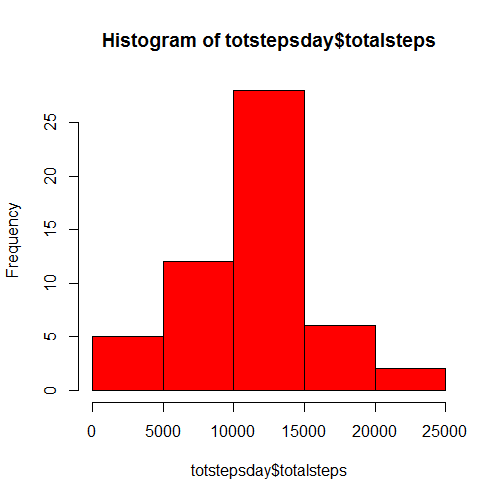
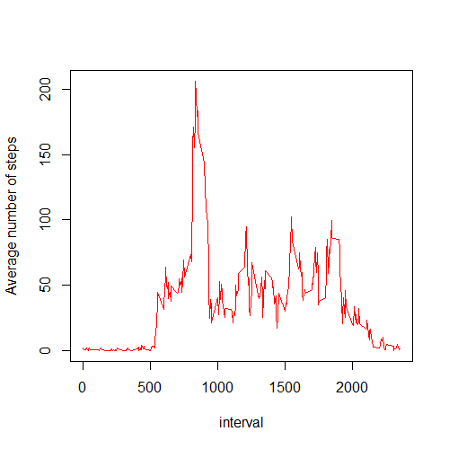
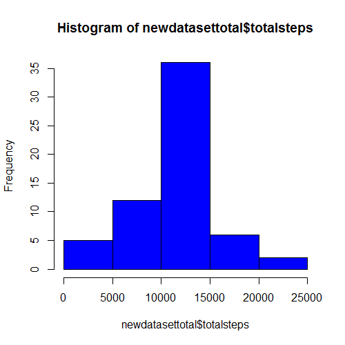
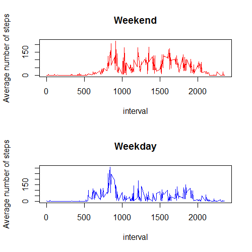

# Programming Assignment 1:
========================================================


## 1) Loading and preprocessing the data

```r
setwd("C:/Users/Media Center/Documents/data")
activity <-read.csv('activity.csv', stringsAsFactors=FALSE, header=TRUE)
```

What is mean total number of steps taken per day?

## 2) Calculate the total number of steps taken per day


```r
totstepsday<- ddply(activity,~date,summarise,totalsteps=sum(steps))
totstepsday
```

```
##          date totalsteps
## 1  2012-10-02        126
## 2  2012-10-03      11352
## 3  2012-10-04      12116
## 4  2012-10-05      13294
## 5  2012-10-06      15420
## 6  2012-10-07      11015
## 7  2012-10-09      12811
## 8  2012-10-10       9900
## 9  2012-10-11      10304
## 10 2012-10-12      17382
## 11 2012-10-13      12426
## 12 2012-10-14      15098
## 13 2012-10-15      10139
## 14 2012-10-16      15084
## 15 2012-10-17      13452
## 16 2012-10-18      10056
## 17 2012-10-19      11829
## 18 2012-10-20      10395
## 19 2012-10-21       8821
## 20 2012-10-22      13460
## 21 2012-10-23       8918
## 22 2012-10-24       8355
## 23 2012-10-25       2492
## 24 2012-10-26       6778
## 25 2012-10-27      10119
## 26 2012-10-28      11458
## 27 2012-10-29       5018
## 28 2012-10-30       9819
## 29 2012-10-31      15414
## 30 2012-11-02      10600
## 31 2012-11-03      10571
## 32 2012-11-05      10439
## 33 2012-11-06       8334
## 34 2012-11-07      12883
## 35 2012-11-08       3219
## 36 2012-11-11      12608
## 37 2012-11-12      10765
## 38 2012-11-13       7336
## 39 2012-11-15         41
## 40 2012-11-16       5441
## 41 2012-11-17      14339
## 42 2012-11-18      15110
## 43 2012-11-19       8841
## 44 2012-11-20       4472
## 45 2012-11-21      12787
## 46 2012-11-22      20427
## 47 2012-11-23      21194
## 48 2012-11-24      14478
## 49 2012-11-25      11834
## 50 2012-11-26      11162
## 51 2012-11-27      13646
## 52 2012-11-28      10183
## 53 2012-11-29       7047
```

## 3) Make a histogram of the total number of steps taken each day


```r
hist(totstepsday$totalsteps, col="red")
```

 

## 4) Calculate and report the mean and median of the total number of steps taken per day


```r
averagestepsday <- mean(totstepsday$totalsteps)
averagestepsday
```

```
## [1] 10766.19
```

```r
medianstepsday <- median(totstepsday$totalsteps)
medianstepsday
```

```
## [1] 10765
```

## 5) Make a time series plot (i.e. type = "l") of the 5-minute interval (x-axis) and the average number of steps taken, averaged across all days (y-axis)


```r
meaninterval<- ddply(activity,~interval,summarise,meaninterval=mean(steps))
plot(meaninterval$interval, meaninterval$meaninterval , ylab = "Average number of steps", xlab = "interval", type= "l", col= 'red'  )
```

 

## 6) Which 5-minute interval, on average across all the days in the dataset, contains the maximum number of steps?


```r
maxinterval <- max(meaninterval$meaninterval)
maxinterval
```

```
## [1] 206.1698
```

```r
answer <- meaninterval[meaninterval$meaninterval == max(meaninterval$meaninterval),]
answer
```

```
##     interval meaninterval
## 104      835     206.1698
```

The interval 835 contains the maximum number of steps on average.


## 7) Calculate and report the total number of missing values in the dataset (i.e. the total number of rows with NAs)


```r
activity <-read.csv('activity.csv', stringsAsFactors=FALSE, header=TRUE)
withna <- nrow(activity)

activitynona <-read.csv('activity.csv', stringsAsFactors=FALSE, header=TRUE)
activitynona <- na.omit(activity)

withoutna <-nrow(activitynona)

natotal <- withna - withoutna

natotal
```

```
## [1] 2304
```


## 8) Devise a strategy for filling in all of the missing values in the dataset. The strategy does not need to be sophisticated. For example, you could use the mean/median for that day, or the mean for that 5-minute interval, etc.
Create a new dataset that is equal to the original dataset but with the missing data filled in.

We will use the mean for that 5 minute interval to fill the NAs:


```r
newdataset <- activity
m<- 0
i<- 0

for (i in 1:nrow(activity))
  
  {
  
  m<- m+1
  
   if (is.na(newdataset$steps[i])==TRUE) 
    
    
      {   newdataset$steps[i] <- meaninterval$meaninterval[m]
      
    
      }

    if(m == nrow(meaninterval))  
      
      { 
        m<- 0
      
      }
  
  }
```


```r
head(newdataset)
```

```
##       steps       date interval
## 1 1.7169811 2012-10-01        0
## 2 0.3396226 2012-10-01        5
## 3 0.1320755 2012-10-01       10
## 4 0.1509434 2012-10-01       15
## 5 0.0754717 2012-10-01       20
## 6 2.0943396 2012-10-01       25
```

## 9) Make a histogram of the total number of steps taken each day and Calculate and report the mean and median total number of steps taken per day. Do these values differ from the estimates from the first part of the assignment? What is the impact of imputing missing data on the estimates of the total daily number of steps?


```r
newdatasettotal<- ddply(newdataset,~date,summarise,totalsteps=sum(steps))
newdatasettotal
```

```
##          date totalsteps
## 1  2012-10-01   10766.19
## 2  2012-10-02     126.00
## 3  2012-10-03   11352.00
## 4  2012-10-04   12116.00
## 5  2012-10-05   13294.00
## 6  2012-10-06   15420.00
## 7  2012-10-07   11015.00
## 8  2012-10-08   10766.19
## 9  2012-10-09   12811.00
## 10 2012-10-10    9900.00
## 11 2012-10-11   10304.00
## 12 2012-10-12   17382.00
## 13 2012-10-13   12426.00
## 14 2012-10-14   15098.00
## 15 2012-10-15   10139.00
## 16 2012-10-16   15084.00
## 17 2012-10-17   13452.00
## 18 2012-10-18   10056.00
## 19 2012-10-19   11829.00
## 20 2012-10-20   10395.00
## 21 2012-10-21    8821.00
## 22 2012-10-22   13460.00
## 23 2012-10-23    8918.00
## 24 2012-10-24    8355.00
## 25 2012-10-25    2492.00
## 26 2012-10-26    6778.00
## 27 2012-10-27   10119.00
## 28 2012-10-28   11458.00
## 29 2012-10-29    5018.00
## 30 2012-10-30    9819.00
## 31 2012-10-31   15414.00
## 32 2012-11-01   10766.19
## 33 2012-11-02   10600.00
## 34 2012-11-03   10571.00
## 35 2012-11-04   10766.19
## 36 2012-11-05   10439.00
## 37 2012-11-06    8334.00
## 38 2012-11-07   12883.00
## 39 2012-11-08    3219.00
## 40 2012-11-09   10766.19
## 41 2012-11-10   10766.19
## 42 2012-11-11   12608.00
## 43 2012-11-12   10765.00
## 44 2012-11-13    7336.00
## 45 2012-11-14   10766.19
## 46 2012-11-15      41.00
## 47 2012-11-16    5441.00
## 48 2012-11-17   14339.00
## 49 2012-11-18   15110.00
## 50 2012-11-19    8841.00
## 51 2012-11-20    4472.00
## 52 2012-11-21   12787.00
## 53 2012-11-22   20427.00
## 54 2012-11-23   21194.00
## 55 2012-11-24   14478.00
## 56 2012-11-25   11834.00
## 57 2012-11-26   11162.00
## 58 2012-11-27   13646.00
## 59 2012-11-28   10183.00
## 60 2012-11-29    7047.00
## 61 2012-11-30   10766.19
```

```r
avgstepsday <- mean(newdatasettotal$totalsteps)
avgstepsday
```

```
## [1] 10766.19
```

```r
medstepsday <- median(newdatasettotal$totalsteps)
medstepsday
```

```
## [1] 10766.19
```

```r
averagestepsday
```

```
## [1] 10766.19
```

```r
medianstepsday
```

```
## [1] 10765
```

```r
hist(newdatasettotal$totalsteps, col="blue")
```

 

We conclude that the average steps per day do not differ and are equal to 10766.19 for both the set that omits NAs and the set that fills NAs with the means of the interval. The median is a little different , 10765 for the set that omits NAs and 10766.19 for the filled set.

## 10) Are there differences in activity patterns between weekdays and weekends?

For this part the weekdays() function may be of some help here. Use the dataset with the filled-in missing values for this part.
Create a new factor variable in the dataset with two levels - "weekday" and "weekend" indicating whether a given date is a weekday or weekend day.
Make a panel plot containing a time series plot (i.e. type = "l") of the 5-minute interval (x-axis) and the average number of steps taken, averaged across all weekday days or weekend days (y-axis). See the README file in the GitHub repository to see an example of what this plot should look like using simulated data.


```r
newdataset$date <- strptime(newdataset$date, "%Y-%m-%d")
newdataset$date <- weekdays(newdataset$date)

weekends <- newdataset[newdataset$date==c("Saturday","Sunday"),]
weekdays <- newdataset[newdataset$date==c("Monday","Tuesday","Wednesday","Thursday","Friday"),]
```

```
## Warning in newdataset$date == c("Monday", "Tuesday", "Wednesday",
## "Thursday", : longer object length is not a multiple of shorter object
## length
```

```r
meanweekend <- ddply(weekends,~interval,summarise, meaninterval=mean(steps))
meanweekdays <- ddply(weekdays,~interval,summarise, meaninterval=mean(steps))

par(mfrow=c(2,1))
plot(meanweekend$interval,meanweekend$meaninterval, main="Weekend", ylab = "Average number of steps", xlab = "interval", type= "l", col= 'red')
plot(meanweekdays$interval,meanweekdays$meaninterval, main="Weekday", ylab = "Average number of steps", xlab = "interval", type= "l", col= 'blue')
```

 
